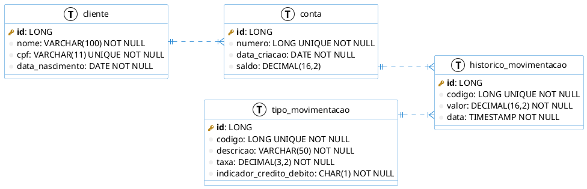

# Vamos checar nosso modelo de dados?

```plantuml
@startuml
!theme vibrant

!define primary_key(x) <b><color:#b8861b><&key></color> x</b>
!define foreign_key(x) <color:#aaaaaa><&key></color> x
!define column(x) <color:#efefef><&media-record></color> x
!define table(x) entity x << (T, white) >>

left to right direction
skinparam roundcorner 5
skinparam linetype ortho
skinparam shadowing false
skinparam handwritten false
skinparam class {
    BackgroundColor white
    ArrowColor #2688d4
    BorderColor #2688d4
}

table( cliente ) {
  primary_key( id ): LONG 
  column( nome ): VARCHAR(100) NOT NULL 
  column( cpf ): VARCHAR(11) UNIQUE NOT NULL
  column( data_nascimento ): DATE NOT NULL
  --
}

table( conta ) {
  primary_key( id ): LONG
  column( numero ): LONG UNIQUE NOT NULL 
  column( data_criacao ): DATE NOT NULL
  column( saldo ): DECIMAL(16,2)
  --
}

table( historico_movimentacao ) {
  primary_key( id ): LONG
  column( codigo ): LONG UNIQUE NOT NULL
  column( valor ): DECIMAL(16,2) NOT NULL
  column( data ): TIMESTAMP NOT NULL
  --
}

table( tipo_movimentacao ) {
  primary_key( id ): LONG
  column( codigo ): LONG UNIQUE NOT NULL
  column( descricao ): VARCHAR(50) NOT NULL
  column( taxa ): DECIMAL(3,2) NOT NULL
  column( indicador_credito_debito ): CHAR(1) NOT NULL
  --
}


cliente ||..|{ conta
conta ||..|{ historico_movimentacao
tipo_movimentacao ||..|{ historico_movimentacao

@enduml
```