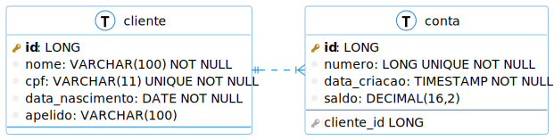

# Projeto

## Atividades

### Requisitos

1. Adicionar o apelido na entidade do cliente.
   O campo apelido deverá ser inserido na base de forma automatica, de acordo com o nome adivindo da request com um client. Pode ser usado a api do RickAndMorty.

2. Criar um controller para conta, e adicionar todas as operações CRUD. Para isso será necessário criar um service e um repository para a entidade conta.
>DICA: A entidade conta necessita das informações do cliente. Criar novo serviço que orquestrar os repositorys de conta e cliente. Para criar uma conta, será necessário buscar o cliente pelo cpf.
O parametro do cpf para o endpoint deverá constar no header.

3. Os controllers serão separados por tags (cliente e conta) para o Swagger.

4. Adicionar tratamentos paras a classe ContaVO com validation.

5. A API deverá ter autenticação com spring security.

